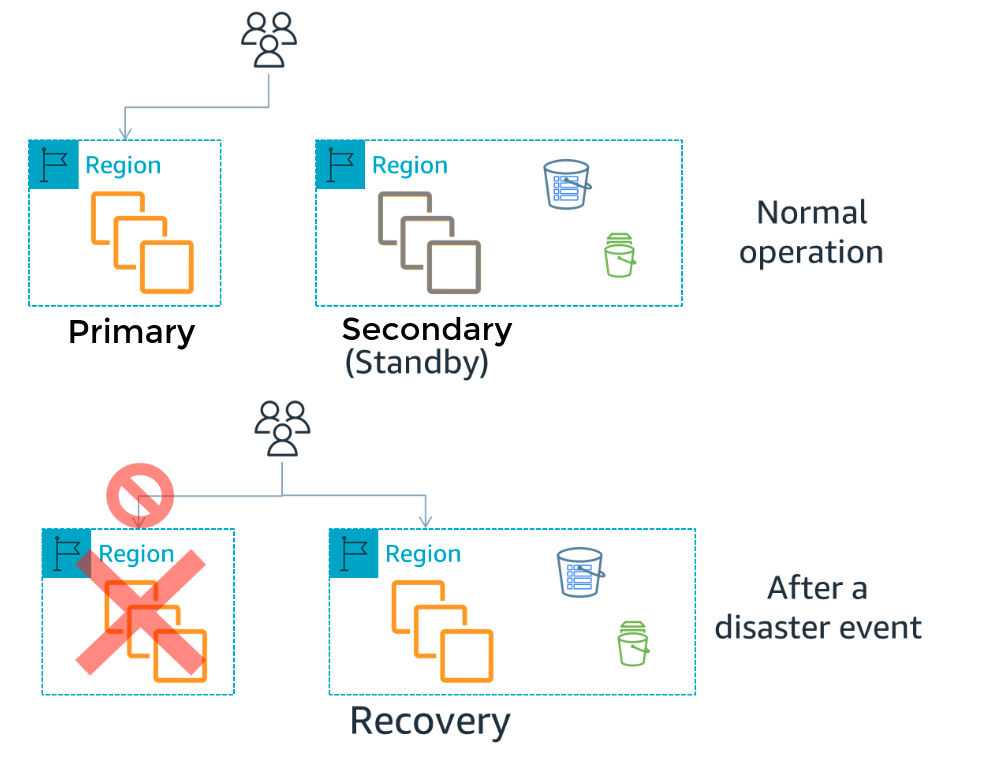
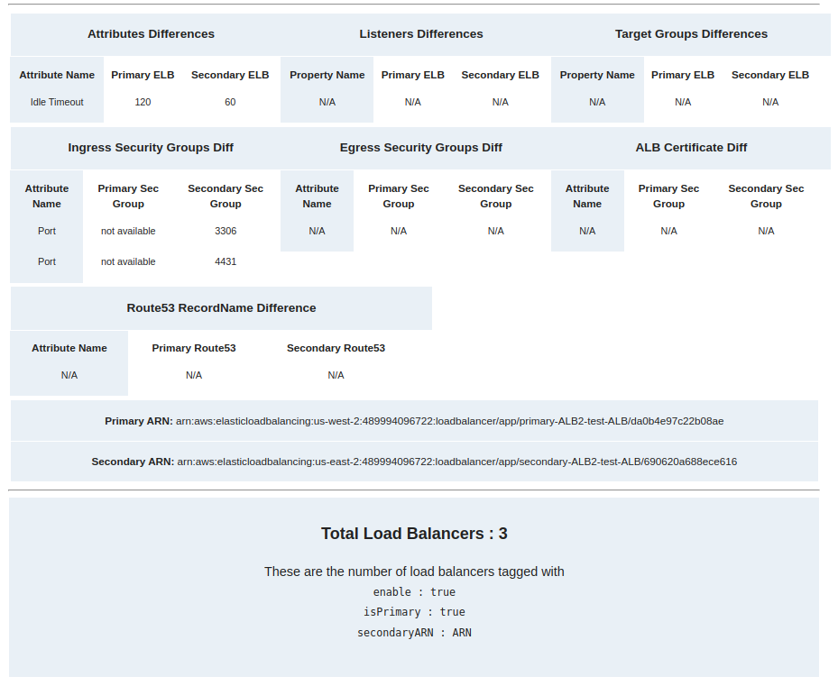

# Disaster Recovery For AWS

## What is Disaster Recovery:
An organization's capacity to respond to and recover from a situation that adversely impacts business operations is known as disaster recovery (DR). The objective of DR techniques is to make it feasible for the organisation to quickly resume using its vital IT infrastructure and systems following a disaster. Organizations frequently conduct a thorough review of their systems in advance of this and produce a formal document that should be followed in a crisis. A disaster recovery plan is what is known as this document.

## Primary/Secondary Region Based DR Strategy:
The workload operates from a single site (in this case an AWS Region) and all requests are handled from this Primary Region. If a disaster event occurs and the Primary Region cannot support workload operation, then the Secondary site becomes the recovery site (recovery Region). We then take steps so that our workload can run from there. All requests are now switched to be routed there in a process called “failover.”

 

Disaster Recovery involves replication of many services from primary region to secondary like Elastic Load Balancers, RDS, Auto Scaling Groups etc.

**This project is focused on finding the differences between Elastic Load Balancers of Primary and Secondary Region.**
### Pre-Requisites:
Before deploying this project, there are some pre-requisites you need to keep in mind.
You have to provision resources in both regions with the same architecture.
##### Tagging Resources:
You have to tag resources in primary region. here are the required tags for your ELB-DR.
- ***enable=true*** 
- ***isPrimary=true***
- ***secondaryARN= “ARN-secondaryLoadbalancer”***


## SAM Project for ELB-DR:
### Project structure:
- handlers: code for all lambda functions
- template.yml: A template defines the application's AWS resources.
```
 sam-app/
   ├── README.md
   ├── handlers/
   │   ├── get_route53_records.py
   │   ├── get_ALB_ARNs.py       
   │   ├── send_email .py
   │   ├── requirements.txt
   │   └── find_elb_difference.py
   └── template.yaml         #Contains the AWS SAM template defining your application's AWS resources.
```
### Labmda Functions:
This application consist of four lambda functions that has different functionality and depends upon each other.
- GetRoute53Record
- SendALBARNs
- FindELBDifference
- SendELBDifferenceEmail
 
#### GetRoute53Record:
This lambda functions scans route 53 hosted zones and filter out the zone ID and search for records in that zone ID extract all A type records (elb dns only) and put them into a dynamodb table.

#### SendALBARNs:
This function scans for application load balancer having tags (enable=true, isPrimary=true and secondaryARN= "ARN-secondaryLoadbalancer") and creates batches and invoke FindELBDifference function for each batch.
#### FindELBDifference:
This functions finds difference in properties of primary and secondary load balanacers,
- Attributes differences
- Listeners differences
- Target groups differences
- Security group difference (ingress and egress)
- ALB Listener certificate
- Route 53 record name differences.

if this function finds any differences between 2 ELBs result is stored in form of json object into a dynamodb table.
#### SendELBDifferenceEmail:
This function is triggered after 15 minutes of SendALBARNs function, The results stored by FindELBDifference function is read by this function from dynamodb table and strcuture into an HTML format and sends an email of all the ELBs differences.

 


#### Resources:
- S3 Bucket configured to work as a static site containing report of differences.
- Dynamodb table to store Route53 DNS.
- Dynamodb table to store differences as a json

### Steps to Build and Deploy this app:
The Serverless Application Model Command Line Interface (SAM CLI) is an extension of the AWS CLI that adds functionality for building and testing Lambda applications. It uses Docker to run your functions in an Amazon Linux environment that matches Lambda. It can also emulate your application's build environment and API.
To build and deploy your application for the first time, run the following in your shell:
##### Step 1: Initialize sam project:
Run the command in you Linux terminal, 

```sam init```

choose custom Template Location and give path of you project zip file.
This command creates a directory with the name as the project name.

##### Step 2: Build your application:
First, change into the project directory, where the template.yaml file for the sample application is located. Then run this command:

```sam build```

or 

```sam build --use-container```

The SAM CLI installs dependencies defined in handlers/requirements.txt, creates a deployment package, and saves it in the .aws-sam/build folder.

##### Step 3: Deploy your application:
To deploy your application you can use following commands, use guided flag when you are deploying for the first time so it can setup all the configuratons in a guide way.

```sam deploy```

or 

``` sam deploy --guided```

